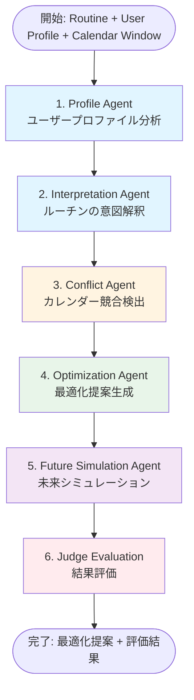
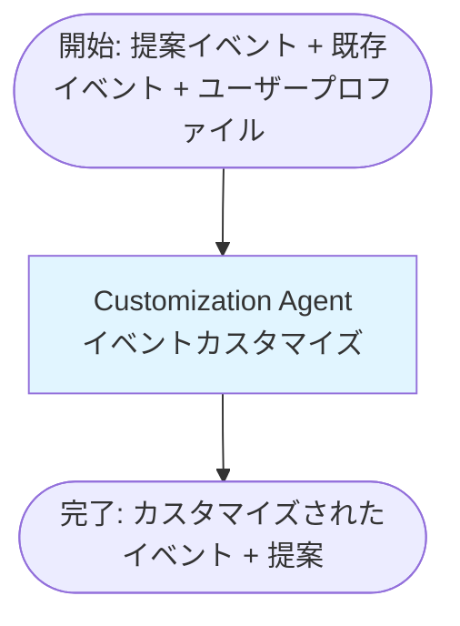

# AIワークフロー可視化

## 概要

Routine Hubでは、2つの主要なAIワークフローが実装されています。

---

## 1. Routine Planning Workflow（ルーチン計画ワークフロー）

ルーチンの詳細ページで実行される、包括的な分析・最適化ワークフローです。

### フロー図

### 各ステップの説明

#### 1. Profile Agent（プロファイル分析）
- **目的**: ユーザーの設定情報を分析し、行動パターンや好みを理解する
- **入力**:
  - タイムゾーン
  - 優先順位（例: 「集中時間を守る」）
  - 制約（例: 「手動確認を好む」）
  - エネルギーレベル（low/medium/high）
- **出力**: ユーザーの行動パターン要約

#### 2. Interpretation Agent（ルーチン解釈）
- **目的**: Routineの目的とTime Blockの意図を解釈する
- **入力**:
  - Routine情報（名前、説明、目的、Time Blocks）
  - Profile Agentの結果
- **出力**:
  - Routineの意図解釈
  - Time Blockごとの目的理解

#### 3. Conflict Agent（競合検出）
- **目的**: 既存のカレンダーイベントとの競合を検出する
- **入力**:
  - Routine情報
  - 解釈結果
  - ユーザープロファイル
  - カレンダー期間
- **出力**:
  - 競合しているイベントのリスト
  - 競合の種類と深刻度

#### 4. Optimization Agent（最適化提案）
- **目的**: 競合を解決し、ユーザープロファイルに基づいて最適化提案を生成する
- **入力**:
  - Routine情報
  - Profile Agentの結果
  - Interpretation Agentの結果
  - Conflict Agentの結果
- **出力**:
  - 時間調整提案
  - エネルギーレベル最適化
  - 競合解決案

#### 5. Future Simulation Agent（未来シミュレーション）
- **目的**: 最適化されたRoutineを実行した場合の未来をシミュレーションする
- **入力**:
  - Routine名
  - Optimization Agentの結果
  - Profile Agentの結果
- **出力**:
  - 実行後の予測される成果
  - 潜在的な課題
  - 推奨事項

#### 6. Judge Evaluation（結果評価）
- **目的**: ワークフローの結果を評価し、品質指標を算出する
- **入力**:
  - Optimization Agentの結果
  - Conflict Agentの結果
  - Future Simulation Agentの結果
- **出力**:
  - 評価スコア（複数の次元で評価）
  - 総合評価
  - 改善提案

### 使用箇所
- **詳細ページ**: Routine詳細ページでAI分析ボタンをクリックすると実行
- **実行制限**: 一般ユーザーは1回、管理者は無制限

---

## 2. Calendar Customization Workflow（カレンダーカスタマイズワークフロー）

カレンダー適用時のプレビュー画面で実行される、イベント個別カスタマイズワークフローです。

### フロー図

### ステップの説明

#### Customization Agent（カスタマイズエージェント）
- **目的**: 提案されたカレンダーイベントを、ユーザープロファイルと既存イベントに基づいて個別に最適化する
- **入力**:
  - `proposedEvents`: 適用予定のイベント配列
  - `existingEvents`: 既存のカレンダーイベント配列
  - `userProfile`: ユーザープロファイル（優先順位、制約、エネルギーレベル、タイムゾーン）
- **処理**:
  1. **競合検出**: 既存イベントとの時間的重複を検出
  2. **LLMによるカスタマイズ**: Bedrock（またはフォールバック）を使用して、以下の観点で最適化
     - 時間調整（優先順位に基づく）
     - エネルギーレベル最適化
     - 競合解決
  3. **提案生成**: カスタマイズの理由と推奨事項を生成
- **出力**:
  - `customizedEvents`: カスタマイズされたイベント配列
    - `proposalId`: 元のイベントID
    - `title`, `description`, `start`, `end`: 調整された内容（オプショナル）
    - `reasoning`: カスタマイズの理由
  - `suggestions`: 提案リスト
    - `type`: 提案タイプ（time-adjustment, energy-optimization, conflict-resolution）
    - `description`: 提案内容
    - `affectedProposalIds`: 影響を受けるイベントID

### 使用箇所
- **プレビュー画面**: カレンダー適用フォームで「AIでカスタマイズ」ボタンをクリックすると実行
- **実行タイミング**: ユーザーが明示的にボタンをクリックした時のみ（自動実行なし）
- **結果表示**: カスタマイズ結果をチェックボックスで切り替え可能

---

## 技術スタック

### Mastra Framework
- **ワークフロー管理**: Mastra Coreを使用したワークフロー定義
- **ステップ定義**: `createStep`で各ステップを定義
- **型安全**: Zodスキーマによる入力/出力検証

### LLM Provider
- **Bedrock**: AWS Bedrockを使用（デフォルト）
- **フォールバック**: Bedrockが無効な場合はヒューリスティック処理

### データフロー
- **入力検証**: Zodスキーマで入力データを検証
- **出力型付け**: 型安全な出力データ構造
- **エラーハンドリング**: フォールバック処理で安定性を確保

---

## 特徴

### Routine Planning Workflow
- ✅ **6段階の分析パイプライン**: 段階的に深い分析を実施
- ✅ **包括的な評価**: 複数の観点から評価・提案
- ✅ **カレンダー統合**: 既存イベントとの競合を考慮
- ✅ **未来シミュレーション**: 実行後の予測を提供

### Calendar Customization Workflow
- ✅ **個別カスタマイズ**: 各イベントを個別に最適化
- ✅ **競合解決**: 既存イベントとの重複を自動検出・調整
- ✅ **柔軟な適用**: ユーザーがカスタマイズ結果を選択可能
- ✅ **高速処理**: シンプルな1ステップ構成で高速実行

---

## 今後の拡張可能性

- **Human-in-the-loop**: Mastraの`suspend()`/`resume()`を使用した手動確認ポイント
- **ストリーミング対応**: リアルタイムで結果を表示
- **履歴管理**: 過去のカスタマイズ履歴を保存・再利用
- **学習機能**: ユーザーの選択パターンを学習して改善
