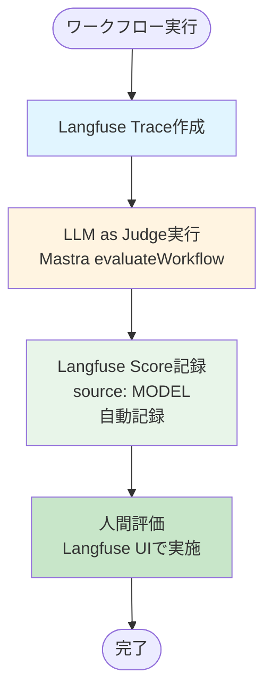
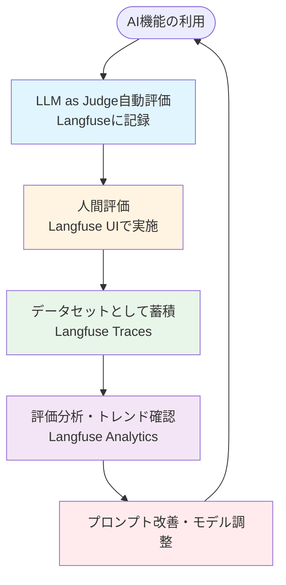

# Langfuse評価統合ガイド

## 概要

Routine Hubでは、Langfuseを使用して**LLM as Judge**と**人間評価（Human Evaluation）**を統合的に管理します。

Langfuseの`score()`機能を使用することで、同じトレースに対して複数の評価（自動評価と人間評価）を記録し、ダッシュボードで一元管理できます。

---

## 人間評価はどこで行うか

Langfuseの標準的な使用方法では、**人間評価はLangfuse UIで直接行う**のが推奨されています。

### 推奨アプローチ: Langfuse UIで評価

**理由:**
- ✅ Langfuseの標準機能（Human Annotation）を活用できる
- ✅ トレースと評価が同じ画面で確認できる
- ✅ チーム協業が容易（複数人で評価可能）
- ✅ 評価基準（Score Config）を事前に定義できる
- ✅ 評価履歴とアナリティクスが統合されている
- ✅ 開発工数を削減できる

**使い方:**
1. Langfuseダッシュボードにアクセス
2. **Traces**タブで対象のトレースを選択
3. **Annotate / Add Score**ボタンをクリック
4. スコアとコメントを入力
5. 保存

**注意:** アプリ側（Adminページ）の評価フォームは削除されました。すべての人間評価はLangfuse UIで行います。

---

## アーキテクチャ

### 評価の流れ



### 評価の種類

| 評価タイプ | 実行タイミング | 記録方法 | `source` |
|----------|-------------|---------|----------|
| **LLM as Judge** | ワークフロー実行時（自動） | `recordLangfuseScore()` | `MODEL` |
| **人間評価** | Langfuse UIから手動 | Langfuse UIのAnnotate機能 | `HUMAN` |

---

## 実装方法

### 1. LLM as Judgeのスコア記録

`evaluateWorkflow`実行後、Mastraワークフロー内でLangfuseにスコアを記録します。

```typescript
// src/features/ai/workflows/routine-mastra-runner.ts
import { recordLangfuseTrace, recordLangfuseScore } from '../evaluation/langfuse-boundary';

export class MastraRoutineAiWorkflowRunner implements RoutineAiWorkflowRunner {
  async run(input: RoutineAiWorkflowInput, options?: RoutineAiWorkflowOptions): Promise<RoutineAiWorkflowResult> {
    const traceId = options?.traceId ?? randomUUID();

    // 1. Langfuse Traceを先に作成
    const langfuse = await recordLangfuseTrace({
      workflow: 'routine-planning-workflow',
      payload: {
        executionId: traceId,
        routineId: input.routine.id
      },
      traceId
    });

    // 2. Mastraワークフロー実行
    const workflow = mastraRepository.getWorkflows().routinePlanningWorkflow;
    if (!workflow) {
      throw new Error('Routine workflow is not registered in Mastra repository');
    }

    const run = await workflow.createRunAsync();
    const runResult = await run.start({
      inputData: input,
      tracingOptions: { traceId }
    });

    if (runResult.status !== 'success' || !runResult.result) {
      throw new Error('Mastra workflow execution failed');
    }

    // 3. LLM as Judgeの評価結果をLangfuseに記録
    if (runResult.result.evaluation) {
      const evalData = runResult.result.evaluation.data;
      const averageScore = (
        evalData.clarity.score +
        evalData.consistency.score +
        evalData.explanationQuality.score
      ) / 3;

      await recordLangfuseScore({
        traceId: langfuse.traceId,
        name: 'judge-overall',
        value: averageScore,
        comment: `Verdict: ${evalData.verdict}`,
        source: 'MODEL',
        metadata: {
          clarity: evalData.clarity.score,
          consistency: evalData.consistency.score,
          explanationQuality: evalData.explanationQuality.score,
          verdict: evalData.verdict
        }
      });
    }

    return {
      ...runResult.result,
      meta: {
        executionId: traceId,
        mastraTraceId: traceId,
        proposalsOnly: true,
        langfuseTraceId: langfuse.traceId
      }
    };
  }
}
```

### 2. 人間評価のスコア記録（Langfuse UI推奨）

**標準的な方法:** Langfuse UIで直接評価

1. **Langfuseダッシュボード**にアクセス
2. **Traces**タブで対象のトレースを選択
3. **Annotate / Add Score**ボタンをクリック
4. スコア名、値、コメントを入力
5. 保存

**メリット:**
- トレースと評価が同じ画面で確認できる
- 評価基準（Score Config）を事前に定義できる
- チーム協業が容易

### 3. 人間評価のスコア記録（アプリ側 - 代替手段）

Adminページから人間評価を記録する場合、同じ`traceId`に対して`source: 'HUMAN'`でスコアを記録します。

```typescript
// src/features/admin/actions/admin.ts
import { recordLangfuseScore } from '@/features/ai/evaluation/langfuse-boundary';
import { getExecutionRecord } from '@/features/ai/execution-log';

export async function addHumanEvaluationAction(input: {
  executionId: string;
  score: number;
  comment: string;
}) {
  const user = await getCurrentUser();
  assertAdminUser(user);

  // ExecutionRecordからlangfuseTraceIdを取得
  const record = getExecutionRecord(input.executionId);
  if (!record?.langfuseTraceId) {
    throw new Error('Execution record or Langfuse trace ID not found');
  }

  // Langfuseに人間評価を記録
  await recordLangfuseScore({
    traceId: record.langfuseTraceId,
    name: 'human-overall',
    value: input.score,
    comment: input.comment,
    source: 'HUMAN',
    metadata: {
      reviewerId: user.id,
      reviewerName: user.displayName
    }
  });
}
```

**注意:** この方法は**代替手段**として残しておきますが、**Langfuse UIでの評価を推奨**します。

---

## Langfuse UIでの確認方法

### スコアの確認

1. **Langfuseダッシュボード**にアクセス
2. **Traces**タブで対象のトレースを選択
3. **Scores**セクションで以下のスコアが表示されます：
   - `judge-overall` (source: MODEL) - LLM as Judgeの評価
   - `human-overall` (source: HUMAN) - 人間の評価（Langfuse UIまたはアプリ側から）

### スコアの比較

- **同じトレース**に対して複数のスコアが記録されるため、自動評価と人間評価を直接比較できます
- **メタデータ**（`clarity`, `consistency`, `explanationQuality`など）も表示されるため、詳細な分析が可能です

---

## Mastra MCPとの統合

### Mastraでの評価実行

Mastraワークフロー内の`judgeStep`で`evaluateWorkflow`を実行します。

```typescript
// src/features/ai/mastra/workflow.ts
const judgeStep = createStep({
  id: 'judge-step',
  inputSchema: futureResultSchema,
  outputSchema: workflowOutputSchema,
  execute: async ({ inputData }) => {
    const evaluation = await evaluateWorkflow({
      optimizations: inputData.optimizations,
      conflicts: inputData.conflicts,
      futureSimulation: inputData.futureSimulation
    });

    // 評価結果は後続のrecordLangfuseScoreで記録される
    return {
      ...inputData,
      evaluation
    };
  }
});
```

### 評価の次元

Mastraの`evaluateWorkflow`は以下の3次元で評価します：

1. **Clarity**（明確性）- 制約の網羅状況
2. **Consistency**（一貫性）- 提案と意図の整合度
3. **Explanation Quality**（説明品質）- オプティマイズ案の多様性

これらのスコアは個別にLangfuseのメタデータとして記録され、総合スコア（平均値）が`judge-overall`として記録されます。

---

## ベストプラクティス

### 1. 人間評価はLangfuse UIで実施（推奨）

- ✅ Langfuse UIの**Human Annotation**機能を使用
- ✅ トレースと評価が同じ画面で確認できる
- ✅ 評価基準（Score Config）を事前に定義できる
- ✅ チーム協業が容易

### 2. Trace IDの一貫性

- すべての評価（LLM Judge + Human）は**同じ`traceId`**に紐づけます
- `traceId`はワークフロー実行時に生成され、後続のすべての評価で使用されます

### 3. スコアの命名規則

- **LLM as Judge**: `judge-overall`, `judge-clarity`, `judge-consistency`など
- **人間評価**: `human-overall`, `human-{dimension}`など

### 4. メタデータの活用

- 評価の詳細情報（各次元のスコア、判定理由など）は`metadata`に記録します
- Langfuse UIでメタデータを確認・分析できます

### 5. 人間評価のタイミング

- **初期開発時**: すべての実行に対して人間評価を行う
- **安定稼働時**: ランダムサンプルまたはエッジケースに集中
- **モデル変更時**: 新しいモデルの評価に対して重点的に実施

---

## 注意事項

### 1. Langfuseが無効な場合

- `LANGFUSE_DISABLE=true`または認証情報がない場合、スコア記録はスキップされます
- アプリケーションの動作には影響しません（警告ログのみ）

### 2. スコアの型

- スコアは`number`型で記録されます（通常は0-1または0-5スケール）
- `comment`はオプションですが、評価の理由を記録することを推奨します

### 3. トラブルシューティング

- Langfuseにスコアが表示されない場合、`traceId`が正しいことを確認してください
- メタデータが表示されない場合、`metadata`オブジェクトの構造を確認してください

---

## データセット運用と改善サイクル

### 評価データの蓄積と分析

**✅ 推奨運用:** Langfuseに記録されたトレースと評価データを**テストデータセット**として蓄積し、継続的な改善に活用します。

**メリット:**
- 評価データが自動的にLangfuseに蓄積される（`recordLangfuseTrace`, `recordLangfuseScore`経由）
- LLM as Judgeと人間評価を統合的に管理できる
- 時系列での評価トレンドを追跡できる
- モデル変更前後の比較が容易

### 運用フロー



### データセット活用のベストプラクティス

1. **定期的なレビュー**
   - 週次/月次でLangfuse Analyticsを確認
   - 評価スコアのトレンドを分析
   - 低スコアのトレースを特定し、改善対象とする

2. **テストケースの抽出**
   - 評価が高いトレースを「成功パターン」として保存
   - 評価が低いトレースを「改善が必要なパターン」として保存
   - Langfuseのフィルタリング機能で特定の条件のトレースを抽出

3. **A/Bテストの実施**
   - プロンプト変更前後の評価を比較
   - Langfuseのメタデータでプロンプトバージョンを識別
   - 評価スコアの変化を追跡

4. **継続的な改善サイクル**
   ```
   1. データ収集（自動）→ 2. 分析 → 3. 仮説立案 → 4. プロンプト改善 → 5. 再評価 → 1に戻る
   ```

---

## プロンプト管理（LLMOps）

### Langfuseでのプロンプト管理

**✅ 推奨:** Langfuseの**Prompt Management**機能を使用してプロンプトを管理することで、LLMOpsの観点から効率的な運用が可能になります。

**メリット:**
- プロンプトのバージョン管理が可能
- プロンプトとトレースの紐づけが自動化される
- プロンプト変更による評価への影響を追跡できる
- チーム内でのプロンプト共有が容易
- A/Bテストやロールバックが容易

### Langfuse Prompt Managementの使い方

#### 1. プロンプトの登録

Langfuse UIでプロンプトを登録し、バージョン管理を行います。

1. **Langfuseダッシュボード**にアクセス
2. **Prompts**タブを選択
3. **Create Prompt**で新しいプロンプトを作成
4. プロンプトテンプレートを入力（変数は`{{variable}}`形式）
5. バージョン管理で履歴を追跡

#### 2. コードからのプロンプト参照

Mastraワークフロー内でLangfuseのプロンプトを参照する場合、`langfusePromptId`を指定します。

```typescript
// 将来的な実装例（現在はMastra内で直接プロンプトを定義）
const prompt = await langfuse.getPrompt({
  promptId: 'routine-optimization-prompt',
  version: 1 // または'latest'
});
```

#### 3. プロンプトとトレースの紐づけ

**✅ 実装済み:** Langfuseのトレースにプロンプトバージョン情報を自動的に記録します。

ワークフロー実行時に、使用される可能性のあるすべてのエージェントのプロンプトバージョン情報を取得し、トレースの`metadata`と`input`に記録します。

```typescript
// src/features/ai/workflows/routine-mastra-runner.ts
// 0. プロンプトバージョン情報を事前に取得（メタデータ記録用）
const promptVersions: Record<string, { version?: number; labels?: string[]; source: string }> = {};
await Promise.all(
  WORKFLOW_AGENTS.map(async (agentName) => {
    const promptInfo = await getSystemPromptInfo(agentName);
    promptVersions[agentName] = {
      version: promptInfo.version,
      labels: promptInfo.labels,
      source: promptInfo.source
    };
  })
);

// 1. Langfuse Traceを先に作成（プロンプトバージョン情報を含める）
const langfuse = await recordLangfuseTrace({
  workflow: 'routine-planning-workflow',
  payload: {
    executionId: traceId,
    routineId: input.routine.id,
    promptVersions // プロンプトバージョン情報を追加
  },
  traceId
});
```

**記録される情報:**
- 各エージェント名（`profile-agent`, `routine-interpreter-agent`など）
- プロンプトのバージョン番号（`version`）
- ラベル情報（`labels`: `development`, `production`など）
- 取得元（`source`: `langfuse` または `fallback`）

**Langfuse UIでの確認方法:**
1. **Traces**タブで対象のトレースを選択
2. **Metadata**セクションで`promptVersions`を確認
3. 各エージェントのプロンプトバージョンと評価スコアの相関を分析

#### 4. プロンプト変更の影響分析

Langfuse Analyticsで以下の分析が可能です：

- **プロンプトバージョン別の評価スコア**: どのバージョンが最も良い評価を得ているか
- **時系列での評価変化**: プロンプト変更による評価スコアの推移
- **エラー率の変化**: プロンプト変更による失敗率の変化

### プロンプト管理のベストプラクティス

1. **バージョニング戦略**
   - セマンティックバージョニング（`v1.0.0`, `v1.1.0`など）を使用
   - 変更内容をコメントで記録
   - メジャーバージョン変更時は十分なテストを実施

2. **段階的ロールアウト**
   - 新プロンプトは少量のトラフィックでテスト
   - 評価が良好であれば段階的に拡大
   - 問題があれば即座にロールバック

3. **A/Bテスト**
   - 異なるプロンプトバージョンを同時に実行
   - Langfuseのメタデータでバージョンを識別
   - 評価スコアを比較して最適なバージョンを選択

4. **ドキュメント化**
   - プロンプトの目的と設計意図を記録
   - 評価基準との関連を明確化
   - チーム内でプロンプトの変更履歴を共有

### 実装状況

**✅ 実装完了:** Langfuse Prompt Managementへの移行が完了しました。

#### 実装内容

1. **`langfuse-boundary.ts`に`getLangfusePrompt`関数を追加**
   - Langfuse SDKを使用してプロンプトを取得
   - 取得失敗時は`null`を返し、フォールバック処理に対応

2. **`prompt-helper.ts`にプロンプト管理機能を追加**
   - `getSystemPrompt`関数: エージェント名に基づいてプロンプトを取得
   - Langfuseから取得できない場合は、コード内で定義されたフォールバックプロンプトを使用
   - `AGENT_PROMPTS`オブジェクト: 全エージェントのフォールバックプロンプトを定義

3. **各エージェントを更新**
   - 全エージェント（6つ）で`getSystemPrompt`を使用するように変更
   - `systemPrompt`を直接文字列で定義する代わりに、Langfuseから取得

#### 対応エージェント

| エージェント名 | Langfuse Prompt Name | フォールバックプロンプト |
|--------------|---------------------|----------------------|
| `profile-agent` | `profile-agent` | ✅ |
| `routine-interpreter-agent` | `routine-interpreter-agent` | ✅ |
| `calendar-conflict-agent` | `calendar-conflict-agent` | ✅ |
| `optimization-agent` | `optimization-agent` | ✅ |
| `future-simulation-agent` | `future-simulation-agent` | ✅ |
| `calendar-customization-agent` | `calendar-customization-agent` | ✅ |

#### 使用方法

```typescript
// src/features/ai/agents/profile-agent.ts
import { getSystemPrompt } from '../evaluation/prompt-helper';

// Langfuseからプロンプトを取得（取得できない場合はフォールバック）
const systemPrompt = await getSystemPrompt('profile-agent');

// または、特定のバージョンやラベルを指定
const systemPrompt = await getSystemPrompt('profile-agent', {
  version: 'latest',
  label: 'production'
});
```

#### Langfuseにプロンプトを登録する手順

1. **Langfuseダッシュボードにアクセス**
   - **Prompts**タブを選択
   - **Create Prompt**をクリック

2. **プロンプトを登録**
   - **Name**: エージェント名（例: `profile-agent`）
   - **Prompt**: プロンプトテンプレート（現在のコード内のプロンプトをコピー）
   - **Labels**: `production`や`staging`などのラベルを設定（オプション）
   - **Version**: バージョン管理を有効化

3. **バージョン管理**
   - プロンプトを変更する場合は、新しいバージョンを作成
   - ラベルを使用して、本番環境とステージング環境で異なるプロンプトを使用可能

#### フォールバック処理

Langfuseからプロンプトを取得できない場合（Langfuseが無効、ネットワークエラー、プロンプト未登録など）、自動的にコード内で定義されたフォールバックプロンプトが使用されます。これにより、Langfuseへの依存を最小限に抑え、アプリケーションの安定性を確保します。

**注意:** Langfuse SDKの実際のAPIは、`client.prompts.get()`や`client.getPrompt()`などの形式が異なる可能性があります。実装後、実際のLangfuse SDKのAPIに合わせて`langfuse-boundary.ts`を調整してください。

---

## 参考資料

- [Langfuse Human Annotation Documentation](https://langfuse.com/docs/evaluation/evaluation-methods/annotation)
- [Langfuse Score API Documentation](https://langfuse.com/docs/scores/model-based-evals)
- [Langfuse Observations](https://langfuse.com/docs/tracing-in-production/observations)
- [Langfuse Prompt Management](https://langfuse.com/docs/prompts/prompt-management)
- [Langfuse Analytics](https://langfuse.com/docs/analytics)
- [Mastra Evals Documentation](https://mastra.ai/docs/reference/evals/answer-relevancy)
